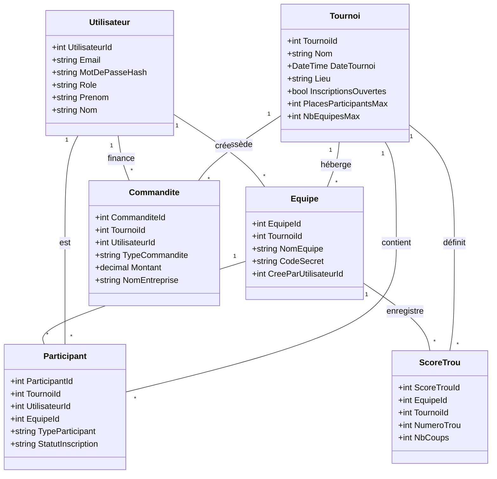

# Diagramme de Classes - Projet Golf G06

Voici le diagramme de classes Mermaid représentant les entités du projet et leurs relations. Vous pouvez copier ce code dans [Mermaid Live Editor](https://mermaid.live/) pour le visualiser.

## Description des Relations
- **Tournoi / Equipe :** Un tournoi peut avoir plusieurs équipes.
- **Tournoi / Participant :** Un tournoi a une liste de participants inscrits.
- **Utilisateur / Role :** Chaque utilisateur a un rôle (ADMIN, EBMPLOYE, COMMANDITAIRE).
- **Equipe / ScoreTrou :** Les scores sont enregistrés par équipe et par trou.
