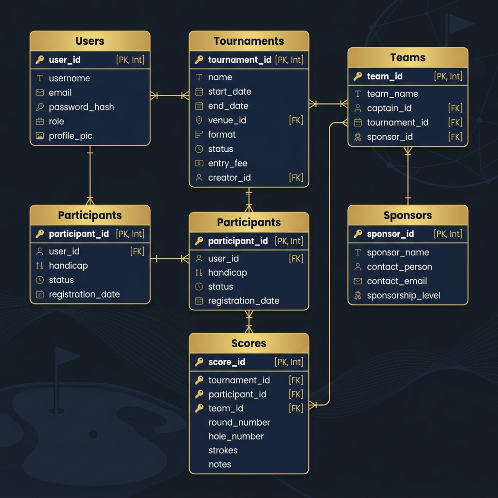
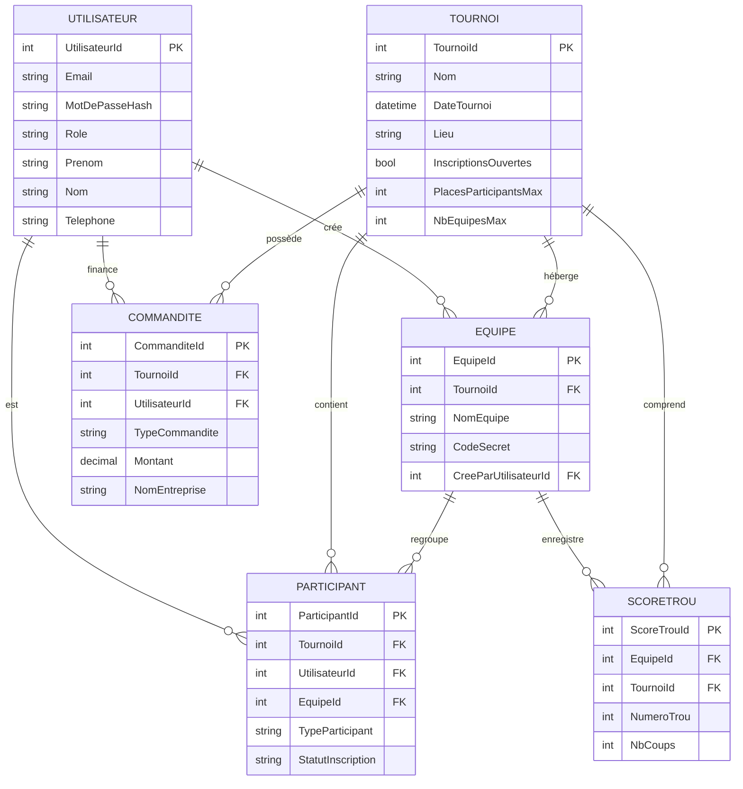

# Schéma de la Base de Données - Golf Tournoi G06

Voici l'organisation de la base de données du projet. Le système utilise Entity Framework Core avec SQL Server.

## Diagramme des Relations (ERD)

## Détails des Tables

### 1. Utilisateurs
Gère les comptes du système (Admin, Participant, Commanditaire, Employé).

### 2. Tournois
Données des événements, lieux, dates et limites de capacité.

### 3. Équipes
Regroupements de 1 à 4 joueurs protégés par un code secret.

### 4. Participants
Lien entre les utilisateurs et les tournois. Gère aussi les invités des commanditaires.

### 5. Commandites
Gère le financement et les forfaits (Or, Argent, Bronze).

### 6. Scores
Suivi des trous (1 à 18) pour chaque équipe pendant un tournoi.
