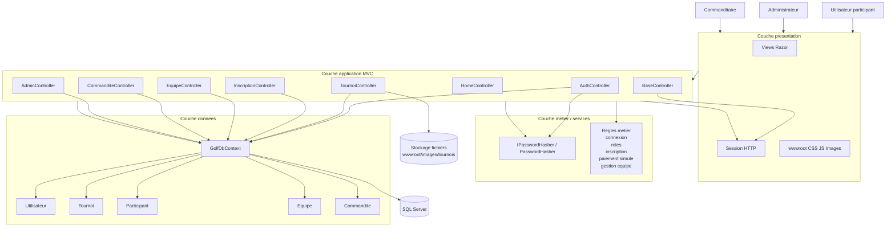

# Schema d'architecture d'application

Ce projet correspond surtout a un **schema d'architecture d'application**.
Le systeme est une application Web ASP.NET Core MVC reliee a une base SQL Server.

## Diagramme Mermaid

## Lecture rapide du diagramme

- Les **acteurs** sont : participant, administrateur et commanditaire.
- La **couche presentation** contient les vues Razor, les fichiers statiques et la session HTTP.
- La **couche application** contient les controllers MVC qui recoivent les requetes et pilotent les cas d'usage.
- La **couche metier** contient le hashage de mot de passe et les regles fonctionnelles.
- La **couche donnees** passe par `GolfDbContext` pour acceder aux entites et a SQL Server.
- Le **stockage de fichiers** sert aux images des tournois televersees par l'admin.

## Blocs a mettre dans Lucidchart

- A gauche : `Participant`, `Administrateur`, `Commanditaire`
- Au centre haut : `Interface Web ASP.NET Core MVC`
- Dans ce bloc, separer :
  - `Views Razor`
  - `Session HTTP`
  - `Controllers`
- Dans `Controllers`, mettre :
  - `AuthController`
  - `TournoiController`
  - `InscriptionController`
  - `EquipeController`
  - `CommanditeController`
  - `AdminController`
- A droite : `PasswordHasher`
- En bas : `GolfDbContext`
- Sous `GolfDbContext` :
  - `Utilisateurs`
  - `Tournois`
  - `Participants`
  - `Equipes`
  - `Commandites`
- Tout en bas : `Base de donnees SQL Server`
- A droite en bas : `Dossier images tournoi`

## Flux importants a annoter

- `AuthController -> PasswordHasher -> Utilisateurs`
- `TournoiController -> Tournois`
- `InscriptionController -> Participants / Equipes / Tournois`
- `CommanditeController -> Commandites / Participants / Tournois`
- `AdminController -> statistiques globales via toutes les tables`
- `TournoiController -> stockage image dans wwwroot/images/tournois`

## Phrase courte pour expliquer le schema

Ce schema montre une architecture MVC en couches : les utilisateurs interagissent avec les vues Razor, les controllers appliquent les regles metier, utilisent la session HTTP pour l'authentification et accedent aux donnees via Entity Framework Core (`GolfDbContext`) relie a SQL Server. Le systeme gere les tournois, les inscriptions, les equipes, les commandites et le tableau de bord administrateur.
